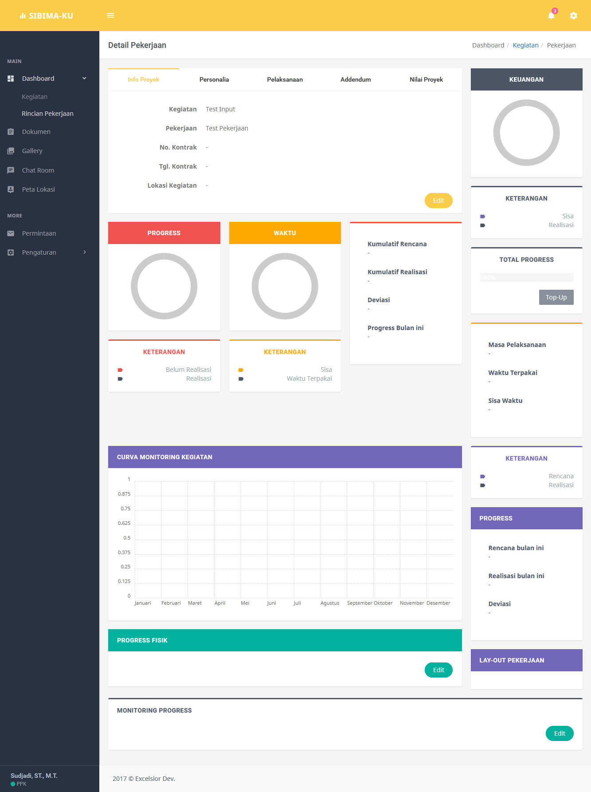

# SIBIMAKU (Sistem Bina Marga Kalimantan Utara)

Uploaded to source control for archivement and persistance purpose. Made in 2017.

As hellish as [my other project](../tlkom-dioc). At least, the UI here was mostly a template so I didn't have to put much effort into building the interface. Nevertheless, the project is quite challenging.

## About

A full-stack backoffice dashboard that handles public work contracts. Features including typical CRUD operations, user and session management, statistics, file management, access management, report management, notification, and news/blogs.

## Stack

Probably using at least PHP version 7. 

UI built in traditional way, using HTML and CSS. UI made from template which is using `Bootstrap` as the base. Templates also comes with many components and plugins.

Mainly using JQuery to manipulate DOM and adding interactivity.

## State

While it's almost feature-complete, it is in the end just a demonstration and I was also being paid as promised so further development was ceased.

## Gallery

[To gallery](./gallery/)

